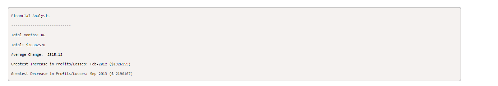

# DKT-console-finances
JavaScript project to demonstrate how I work with beginner knowledge.

## Description

I have created my prohject to demonstrate my basic knowledge of Javascript. I have used my own knowlege and reserached a lot of my problems to make a solution. I have learnt how to use for loops, if statements, arrays etc. Refer to the console in the Chrome dev tools to see what I have done. Refer to the code file to see the code.

## Installation

Using the live link will enable you to use this application. Right click and then select 'inspect.' Aterwards, go to the 'console' tab. This will show you what I have printed to the console.

## Usage

Refer to the console in the Chrome dev tools to see what I have done and refer to the code file to see the code.

Below is a screenshot of my portfolio:

    ```md
    
    ```

## Credits

N/A

## License

Please refer to the license in the repo.